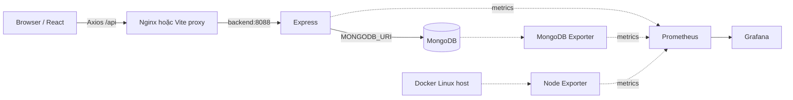

# Pins — dự án React / Express / MongoDB và DevOps

Bản dự án hoàn chỉnh phục vụ học tập và demo **chạy local**, được phát triển theo ý
tưởng bảng ảnh của source `pinterest_aws_project`. Không cần AWS, S3 hay thuê VPS.
Terraform/Ansible và workflow VPS là phần mã tùy chọn để đáp ứng đề bài, không chạy
khi khởi động local.

## 1. Chạy nhanh trên Windows — tất cả bằng Docker

Yêu cầu: Docker Desktop đang **Running**, chế độ **Linux containers**, Docker Compose
2.24.4 trở lên. Nên dành 4 GB RAM cho app/monitoring; nếu chạy thêm Jenkins, nên dành
6–8 GB RAM. Lần đầu cần Internet để tải image và package. Sau khi build và seed,
ảnh mẫu được phục vụ ngay từ frontend, không phụ thuộc dịch vụ ngoài.

Mở PowerShell tại thư mục chứa README này:

```powershell
powershell -ExecutionPolicy Bypass -File .\scripts\start.ps1
```

Script kiểm tra Docker, dùng Node container tạo `.env` ngẫu nhiên, build/start
7 dịch vụ và seed 8 ảnh mẫu. Không cần cài Node trên Windows cho cách chạy này.
`ExecutionPolicy Bypass` ở đây chỉ áp dụng cho tiến trình chạy script đó.

| Dịch vụ | Địa chỉ |
|---|---|
| Ứng dụng React | http://localhost:8080 |
| Kiểm tra API + DB | http://localhost:8080/api/health/ready |
| Grafana | http://localhost:3000 |
| Prometheus targets | http://localhost:9090/targets |
| Prometheus alerts | http://localhost:9090/alerts |

Grafana: username `admin`, mật khẩu là giá trị `GRAFANA_ADMIN_PASSWORD` trong `.env`.
Vào **Dashboards → Pins Local → Pins — Host, MongoDB & API**. Đợi khoảng 30 giây
cho lần scrape đầu; biểu đồ `rate(...[5m])` cần ít nhất hai lần scrape.

Linux/macOS:

```bash
bash scripts/start.sh
```

Nếu đã cài Node 24, có thể chạy các bước tương đương:

```powershell
node scripts/setup.mjs --local
docker compose config --quiet
docker compose up -d --build --wait --wait-timeout 240
docker compose exec -T backend node src/seed.js
```

## 2. Chức năng ứng dụng

- Bảng ảnh masonry responsive, tìm kiếm tiêu đề/mô tả.
- Thêm, chỉnh sửa, xóa ảnh bằng URL, xác nhận trước khi xóa.
- Chọn ảnh mẫu đi kèm hoặc nhập URL ảnh http/https.
- Trạng thái tải, lỗi kết nối, kết quả trống; ảnh lỗi có fallback.
- Kiểm tra dữ liệu ở backend, giới hạn kích thước payload, escape ký tự regex.
- Dữ liệu lưu MongoDB, không mất khi restart container hoặc `docker compose down`.
- Seed có thể chạy lại: không tạo trùng ảnh mẫu, không xóa dữ liệu người dùng.

Đây là demo một người dùng, chưa có đăng nhập/ phân quyền hoặc upload file ảnh.
API liệt kê tối đa 200 ảnh mới nhất. Source mẫu chỉ có chức năng đọc/ghi bản ghi
DynamoDB và hiển thị ảnh S3; bản này chuyển sang MongoDB và mở rộng CRUD, không
sao chép dữ liệu thật hay thông tin truy cập AWS từ source mẫu.

## 3. Kiến trúc và cấu trúc thư mục



```text
backend/                  Express, MongoDB model, validation, tests, seed, Dockerfile
frontend/                 React/Vite, Axios, Nginx, ảnh mẫu SVG, Dockerfile
docker-compose.yml        Toàn bộ app + monitoring
docker-compose.dev.yml    Mở cổng loopback MongoDB/backend cho debug
monitoring/               Prometheus rules, Grafana datasource/dashboard
infra/mongo/              Khởi tạo user ứng dụng và monitoring
infra/terraform/          AWS EC2 + mạng + security group (tùy chọn)
infra/ansible/            Cài Docker và triển khai Ubuntu (tùy chọn)
.github/workflows/        CI, deploy local, deploy VPS tùy chọn
ci/jenkins/               Jenkins container + Docker-in-Docker
Jenkinsfile               Pipeline checkout → test/build → deploy → verify
scripts/                  Setup, start, verify, smoke, deploy
docs/                     Hướng dẫn CI/CD, VPS, demo và kết quả kiểm tra
```

## 4. Luồng Localhost → Docker Desktop → VPS

### Bước A — Localhost để debug

Chế độ này cố ý chạy Node/Vite trực tiếp, MongoDB vẫn cài bằng Docker. Cách ở mục 1
mới là bản đóng gói toàn bộ ứng dụng bằng Docker đáp ứng yêu cầu chính.

```powershell
node scripts/setup.mjs --local
docker compose -f docker-compose.yml -f docker-compose.dev.yml up -d mongodb
cd backend
npm ci
npm run seed
npm run dev
```

Mở terminal thứ hai tại thư mục dự án:

```powershell
cd frontend
npm ci
npm run dev
```

Mở http://localhost:5173. `frontend/src/api.js` dùng `VITE_API_BASE_URL=/api`;
Vite chuyển tiếp `/api` đến `API_PROXY_TARGET=http://127.0.0.1:8088`.
Backend đọc `backend/.env` với hostname MongoDB là `127.0.0.1`.

### Bước B — Docker Desktop

Dừng hai tiến trình dev bằng Ctrl+C. Dừng stack dev để loại bỏ các cổng debug:

```powershell
docker compose -f docker-compose.yml -f docker-compose.dev.yml down
docker compose up -d --build --wait --wait-timeout 240
docker compose exec -T backend node src/seed.js
```

Volume vẫn được giữ. Nginx chuyển `/api` tới `backend:8088`; backend kết nối
`mongodb:27017`, **không dùng localhost bên trong container để tìm database**.
Trình duyệt luôn gọi `/api` cùng origin, không gọi tên service Docker.
Compose cung cấp env backend trực tiếp; `backend/.env` chỉ dùng cho Node chạy ngoài Docker.

### Bước C — VPS chỉ là phần chuẩn bị

Xem [hướng dẫn VPS](docs/VPS.md). Không cần làm bước này để chạy hoặc demo local.
Không có workflow nào tự `terraform apply`.

## 5. Monitoring

Prometheus thu thập bốn target: chính Prometheus, Node Exporter, MongoDB Exporter,
Express. Dashboard gồm CPU, RAM, số CPU logic, tổng RAM, disk, network, trạng thái
target, MongoDB UP/connections/operations/memory, request rate và latency API.

**Trên Docker Desktop, số liệu Node Exporter thuộc Linux VM của Docker, không phải
toàn bộ Windows host.** CPU/RAM/disk trên Linux VPS là số liệu của Linux host.
Riêng panel network trong cấu hình bridge mặc định đo network namespace của
container Node Exporter, không phải tổng traffic host. Jenkins chạy
Docker-in-Docker là một môi trường demo riêng; namespace có thể làm khác các số
liệu filesystem/network so với app trực tiếp trên Docker Desktop.

MongoDB exporter dùng user `exporter`, tách khỏi `pins` của backend và `root`.
`up{job="mongodb"}` chỉ báo scrape exporter; `mongodb_up` mới báo kết nối DB.
Alert rules được nạp sẵn, hiển thị trong Prometheus; chưa cấu hình gửi email/Slack.

## 6. Kiểm thử và vận hành

Sau khi stack lên khoảng 30 giây:

```powershell
powershell -ExecutionPolicy Bypass -File .\scripts\verify.ps1
```

Script kiểm tra Nginx, Prometheus config, CRUD xuyên frontend proxy/API/DB,
4 targets và `mongodb_up`. Smoke tạo một bản ghi tạm rồi xóa chính bản ghi đó.

```powershell
docker compose ps
docker compose logs --tail 100 backend mongodb
docker compose logs --tail 100 mongodb-exporter node-exporter
docker compose stop
docker compose start
docker compose down
```

`down` giữ dữ liệu. **`down -v` xóa database, dashboard state và metrics history**;
chỉ dùng khi chủ động muốn reset demo. Không đổi password trong `.env` sau khi
Mongo đã khởi tạo rồi kỳ vọng password trong database tự đổi: init scripts chỉ
chạy khi volume trống. Hãy giữ `.env`, hoặc đổi user password trong MongoDB trước.

Test unit và build với Node 24:

```powershell
cd backend
npm ci
npm test
cd ../frontend
npm ci
npm run build
```

Test integration cần `TEST_MONGODB_URI` tới database test riêng. GitHub CI tự tạo
MongoDB tạm, chạy test integration rồi dọn container CI. Không đặt URI test tới
database đang dùng để demo.

Nếu cổng đã bận, sửa `WEB_PORT`, `GRAFANA_PORT`, `PROMETHEUS_PORT` trong `.env` rồi
chạy lại Compose. Nếu báo `permission denied`/`pipe docker_engine`, kiểm tra
Docker Desktop Running và quyền truy cập Docker của terminal/tài khoản đang chạy.

## 7. CI/CD và nội dung nộp bài

- [GitHub Actions và Jenkins local](docs/CI-CD.md)
- [Terraform và Ansible tùy chọn](docs/VPS.md)
- [Kịch bản demo và đối chiếu yêu cầu](docs/DEMO.md)
- [Báo cáo kiểm thử thực tế](docs/VERIFICATION.md)

Các mật khẩu được tạo ngẫu nhiên trong `.env`, bị loại khỏi Git/ZIP. Không commit
`.env`, Terraform state, SSH private key hoặc Jenkins credentials. Code gốc không
bị sửa. Ảnh SVG mẫu được tạo riêng cho dự án này.

## Tài liệu tham khảo

- [Docker Compose deployment](https://docs.docker.com/compose/how-tos/production/)
- [Node Exporter và host filesystem](https://github.com/prometheus/node_exporter)
- [MongoDB Exporter và quyền monitoring](https://github.com/percona/mongodb_exporter)
- [Jenkins trong Docker](https://www.jenkins.io/doc/book/installing/docker/)
